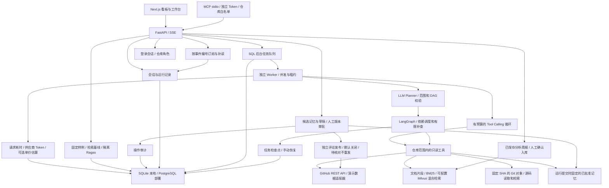

# DevFlow AI 实现路线

基于[小林公开项目介绍](https://xiaolincoding.com/project/devflow.html)独立实现。当前没有课程源码，不能声称复刻了其内部实现或界面。采用 Python + FastAPI + Next.js + TypeScript，逐步加入 LangGraph、PostgreSQL 和 Milvus。

## 第一版验收范围

- 可运行的前后端、仓库看板、会话、SSE 进度和持久化分析记录。
- Issue 分诊、PR 风险分析、CI 排障和固定拓扑的 LangGraph 协作流程。
- 默认演示模式：使用自带样例和确定性规则分析，页面明确标注，零密钥也能验证整个流程。
- 真实模式：通过 GitHub REST API 读取仓库、Issue、PR 文件和 Actions；通过 OpenAI 兼容协议接入支持 Tool Calling 的模型。配置错误直接报错，不自动伪装成演示结果。
- 工具调用设步数和重复次数限制；结果附证据来源；评论只保存草稿。
- 第一版知识检索使用仓库内的关键词检索，不宣称实现了向量 RAG。
- 本地使用 SQLite 跑通链路；目标部署使用 PostgreSQL。Milvus 在后续向量检索阶段接入，不能仅因 Compose 中存在该服务就算完成。

## 分阶段建设

2026-10-06 v0.2：阶段 1 已交付；阶段 2 已实现 Markdown 文档版本、切分与引用、仓库隔离的 BM25、Embedding/Milvus 适配器、索引批次激活、RRF 与可选重排。真实模型接入 DeepSeek V4 Pro。Milvus/Embedding 仍需实机联调；增量同步、Webhooks 与 Git 工作区未完成，不能将阶段 2 标为全部完成。

2026-10-06 v0.3：新增默认分支 Git 对象工作区、当前项目本地快照、固定 SHA 的文件浏览与代码检索。阶段 3 已实现 LLM Planner、计划范围和 DAG 校验、并发限制、专用任务超时、失败依赖跳过、缺证与版本差异检查、一次有限补查及汇总降级。进度与结果持久化，进程重启会将未完成运行标记为中断；尚不能从 checkpoint 恢复执行，因此阶段 2、3 仍有待完成项。

| 阶段 | 交付内容 | 验收场景 |
| --- | --- | --- |
| 1：端到端基础 | 当前第一版范围 | 选择示例仓库，输入问题，看到工具进度、结论、证据；重启后仍可查分析记录 |
| 2：数据与检索 | 增量同步、Webhooks、Git 工作区、文档切分、Embedding、Milvus、关键词与向量混合召回、RRF、Rerank | 当前代码对应 commit SHA；文档与仓库隔离；固定问题能检索到来源段落 |
| 3：复杂协作 | LLM Planner、任务依赖 DAG、并发限制、失败跳过、Observer、有限重规划、上下文摘要 | 缺少 CI 或模型失败时保留已完成结论，明确缺证，工作流可恢复 |
| 4：记忆与写操作 | 候选记忆、人工批准、用户权限、草稿审批、GitHub 写回、幂等及审计 | 未批准草稿无法写 GitHub；重复提交不会重复执行；过期 PR 结论重新校验 |
| 5：评测与交付 | 固定评测集、Ragas、成本与耗时统计、MCP/Skill 扩展、周报沉淀、部署 | 比较检索与 Prompt 修改前后效果；按 README 可以部署并完整演示 |

2026-10-06 v0.4：阶段 3 新增应用层 SQL 任务检查点、停止/重启后的手动恢复、终态结果复用、原文档/源码版本固定、恢复次数和补查预算限制、执行令牌与 PR head 变化检测。它恢复的是已保存任务之间的边界，不续接任务内部模型请求，也不是 LangGraph 原生 Checkpointer；任务队列、SSE 重连和语义冲突评测仍未实现。

## 架构边界

2026-10-06 v0.5：新增持久化 SQL 队列与独立 Worker、运行级并发限制、执行租约/心跳、跨进程停止请求、事件游标重放和浏览器自动重连。页面断开/API 重启与执行解耦；Worker 中断后不自动重试模型，保留任务检查点等待手动恢复。

2026-10-06 v0.6：进入阶段 4，已实现候选记忆、人工批准、版本固定的记忆检索，Cookie 登录与仓库角色，草稿版本审批、PR head 核对、隔离的评论发布客户端、并发领取、结果不明时只读核对及审计。页面已有“记忆与审批”，不是仅修改阶段标签。发布默认关闭，本轮使用模拟 GitHub 验证，没有实际发送评论。

| 当前状态 | 仍需完成 |
| --- | --- |
| 阶段 1 已交付；阶段 3 后台协作及恢复已验证；阶段 4 基础功能已交付；阶段 2 本地中文向量已联调，事件分项刷新和 Webhook 队列已测试 | 阶段 2 的 Standalone/重排、Webhook HTTPS 真实投递、自动对账；阶段 3 的语义冲突评测 |
| 阶段 4 登录、批准记忆、草稿审批、发布防护已实现 | 真实私有仓库写回联调、密码轮换/找回、企业身份及生产部署加固；自动超长会话摘要仍未实现 |
| 阶段 5 基础功能已实现：固定评测集、检索基线、Ragas 非模型指标、实际用量、周报入库、MCP 只读工具；真实回答标注、Prompt 对照、固定样本集和四种任务 Skill 已实现 | 真实人工标注集与代表性模型/Prompt/Skill 质量评估、语义冲突评测、更多任务流程、外部 MCP 客户端使用及容器实机部署 |

2026-10-07 v0.7：进入阶段 5，新增“评测与交付”页面和持久化批次，固定集包含 4 个检索问题及 4 个演示分析检查。Ragas 在隔离环境计算固定文本的非模型指标；模型用量依赖供应商返回，未知用量和单价不补算。周报限定本地已完成分析并经人工确认入库。MCP 使用独立 Token 与仓库白名单，官方 stdio 客户端协议已在临时库联调，默认未向实际仓库开放。

2026-10-07 v0.8：实际启动离线中文 CPU 模型 BAAI/bge-small-zh-v1.5 和官方 Milvus Lite 3.2.1，跑通 512 维索引与 RRF 混合检索。新增模型内容指纹、独立本地授权、连接检查和历史周报片段提示。真实集成回归在独立测试库验证 4 个固定改写问题、仓库/批次隔离、文档变更后拒绝旧索引及缓存复用；成绩只属于这些固定样例。Lite 是本机开发路线，尚不能据此声称完成 Standalone 或生产部署。

侧栏“5 / 5”代表当前建设阶段，不表示所有服务已经完成，也不代表项目已完成生产验收。当前交付的是五阶段的本地基础闭环，表中待完成项仍需逐项推进。

2026-10-07 v0.9：新增 GitHub 事件范围刷新、原始字节 HMAC 验签、仓库名/数字 ID/白名单校验、投递去重、SQL 持久化收件箱、独立 Worker 执行及仓库同步租约。快照只来自当前 GitHub REST 响应，分项时间独立保存；手动同步、事件刷新和旧进程提交均受同一租约保护。Webhook 接收合同与跨进程恢复已在临时库测试，真实仓库保留手动同步；HTTPS 投递和生产部署未联调。

2026-10-07 v0.10：升级固定 SHA 源码检索，按 Python AST 函数/类与有上限的行段切分，用 BM25、标识符拆词、路径和定义匹配排序。其他语言与解析失败的 Python 明确按行检索，长定义保留部分覆盖标记。页面与 Agent 共用检索器，证据保留符号、来源与行号。core-v2 扩充为 18 条固定样例，包含旧/新源码策略对照；这是开发回归，不是模型或真实仓库质量评测。语义源码向量、真实标注、生产部署等待完成项仍保留。

PR 证据必须记录 head SHA，CI 优先匹配该 SHA。同步列表属于有范围的快照，不能从一个分页的样本推断整个仓库健康。Issue、代码和日志都是不可信输入，工具注册表和仓库范围由服务端控制。模型不得自行构造外部写操作。

## 开发顺序与学习目标

1. 先理解 FastAPI 路由、Pydantic 数据模型、数据库会话和 SSE。
2. 跑通一次模型 Tool Calling：模型选工具、后端校验参数、执行、回传、停止。
3. 分别看懂 Issue/PR/CI 的输入证据和结构化输出。
4. 看 LangGraph 的节点、状态、并行结果合并和 Observer。
5. 再做向量检索、长期记忆和审批，不把基础设施一次性堆满。

## 已检查的开发环境

2026-10-06：Python 3.12.3、Node.js 24.14.0、npm 11.9.0、Git 2.53.0；未发现 Docker 和 uv。Windows 的 `py` 默认指向 Python 3.6，因此本项目脚本明确使用 `python` 创建 3.12 虚拟环境。

后续真实联调需要目标仓库以及模型配置。密钥放在本地 `.env`，不提交到 Git，不需要发到聊天里。

技术参考：[LangGraph](https://docs.langchain.com/oss/python/langgraph/overview)、[GitHub PR API](https://docs.github.com/en/rest/pulls/pulls)、[GitHub Actions Jobs API](https://docs.github.com/en/rest/actions/workflow-jobs)、[Next.js](https://nextjs.org/docs/app/getting-started/installation)。

2026-10-07 v0.11：增加有限源码数值核对，支持固定 Python 片段的直接数值声明与特定 BM25 公式参数。冲突移出主回答但保留原文，传入协作汇总，并拦截自动草稿；历史复核为只读预览。core-v3 新增 16 条数值行为回归，总计 34 条；仍不代表自然语言事实验证或模型质量评测，完整语义冲突、真实标注与生产部署继续保留为待完成项。

2026-10-07 v0.12：针对已保存真实回答中的 BM25 解释错误，增加分子乘数/k1+1 与长度常数项/1-b 的有限关系句式核对。数值与关系分类展示，引用/版本/作用域固定，源码字面量写法与数学关系分开处理。finding 整项隔离并沿用自动草稿拦截、历史只读复核及协作冲突传递。core-v4 增加 26 条关系与解析边界回归，共 60 条；通用语义评测、真实标注、Prompt A/B、生产部署仍待完成。

2026-10-08 v0.13：新增真实回答评审页面与仓库范围的版本 API，逐字段填写判断、理由和所用证据；从原回答恢复被自动隔离的段落。不可覆盖旧标注，回答或证据变化后旧标注过期，并发与重复保存受保护。统计和导出只覆盖最近 30 次已完成分析，未标注不算正确，人工标注不会替代有限自动检查或审批。真实 gold 标注集、通用语义质量、Prompt A/B 和生产部署仍待完成。

2026-10-08 v0.14：新增两个服务端分析 Prompt 版本、提交/排队/恢复绑定校验，以及保存原回答的只读对照与导出。新回答记录实际系统指令、输入/来源/模型参数指纹；只对单次源码/知识分析核对同源条件，历史未知版本、不同输入和多 Agent 不冒充受控比较。对照展示人工评审与用量，不生成胜者或准确率；真实 gold 数据、代表性 Prompt 质量评估、浏览器交互验收和生产部署仍待完成。

2026-10-08 v0.15：新增同一冻结输入的两版后台任务提交、仓库范围的幂等编号、整组事务入队、状态记录和停止。提交只支持源码/知识任务，固定同一份来源与模型参数；完成后仍验证实际模型输入，失败不自动补发。真实对照样本用于检查完整链路，人工 gold 标注、代表性质量评估和生产部署仍需继续建设。

2026-10-08 v0.15 真实联调：经用户批准具体源码预览与官方目的地后，完成一组 DeepSeek V4 Pro 的 baseline-v1/evidence-first-v2 分析，共两次调用。核对实际完整输入与预览一致、来源固定、用量完整、历史不变和前端代理可读取两条结果；没有新增人工标注或质量胜者。后端 282 项回归及前端构建已通过，浏览器交互验收仍受工具不可用限制。

2026-10-08 v0.16：新增固定评估样本集，将选定的已完成真实同源对照保存为不可覆盖的原回答/证据/版本/用量快照；按模型参数和 Prompt 分组查看当前有效人工标注覆盖，变化或过期来源明确排除。支持从固定样本打开较早的回答评审和 JSON 导出，不新增模型调用或人工标签。完整后端回归 295 项通过（含实机向量），前端构建通过。真实 gold 标注、代表性问题覆盖和质量评估仍需继续建设。

2026-10-09 v0.17：新增服务端固定注册的四种任务 Skill：源码解释、PR 审查、CI 排障、发布前协作检查。工作台选择流程、预览要求、填写明确目标，运行固定定义版本与指纹，执行和恢复前校验，工具按流程缩小范围。实际系统指令与结果保留所选版本，不同 Skill 分别统计；旧真实对照和评估样本保持兼容。规则演示和 HTTP 模拟用于验证运行链路，没有新增真实模型调用；真实流程质量、更多可复用流程与部署仍需继续验收。

2026-10-10 v0.18.2：正式 Railway HTTPS 服务和预设地址 APK 已交付，登录、持久卷、独立 Worker、真实源码分析与实际重启后数据保留已验证。新增 GitHub Actions 隔离检查，PR 与主分支 checks 成功；CI 证据固定 run_attempt，日志缺失保留 job/步骤与覆盖缺口。真实 DeepSeek PR 审查及 Planner/PR/CI/源码/Synthesis 协作完成，CI 证据对应 PR head，没有用其他提交的失败演练代替。已连接 main 并从 GitHub 源码构建；推送自动部署、安卓实机操作与代表性人工质量评估按验证记录分别核验，仍不能将阶段 5 写成全部生产验收完成。
